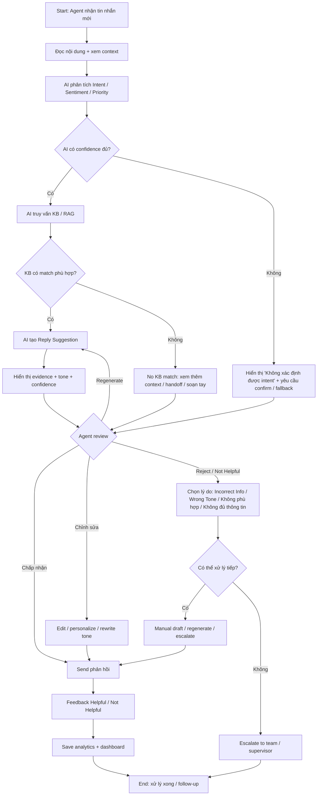

# ReplyMind – Tổng hợp Primary User Flow, Alternative User Flows và Optimized Flow

## 1. Mục tiêu tổng hợp

Tài liệu này hợp nhất ba phần chính của quá trình thiết kế User Flow cho ReplyMind:

1. Primary User Flow – luồng chính.
2. Alternative User Flows – các luồng thay thế theo tình huống thực tế.
3. Optimized User Flow Analysis – phân tích các điểm gây friction, dead end, unnecessary step và recovery path cần bổ sung.

Mục tiêu của tài liệu là làm rõ:

- Agent cần xử lý tin nhắn khách hàng như thế nào.
- AI hỗ trợ ở đâu, và AI không được thay thế quyết định của Agent.
- Khi AI phù hợp / cần chỉnh sửa / không phù hợp / mức độ ưu tiên cao / thiếu thông tin, luồng xử lý thay đổi ra sao.
- Cần tối ưu hóa những bước nào để nâng hiệu suất, giảm thao tác và tăng kiểm soát chất lượng.

---

## 2. Primary User Flow – Luồng chính

### Luồng chính ngắn gọn

Bắt đầu → Nhận tin nhắn → AI phân tích intent / sentiment / priority → AI truy vấn KB → AI tạo AI Reply Suggestion theo Brand Tone → Agent Review → Chấp nhận / chỉnh sửa / từ chối → Gửi phản hồi → Feedback → Dashboard

### Luồng chính mô tả chi tiết

- Agent mở Inbox và nhận tin nhắn mới.
- ReplyMind phân tích Intent, Sentiment, Priority.
- AI truy vấn Knowledge Base theo RAG để lấy thông tin liên quan.
- AI tạo AI Reply Suggestion dựa trên Brand Tone của thương hiệu.
- Agent review và quyết định chấp nhận, chỉnh sửa hoặc từ chối.
- Agent gửi phản hồi bằng 1-click send.
- Agent đánh giá Helpful / Not Helpful.
- Hệ thống lưu dữ liệu phục vụ dashboard và kiểm soát chất lượng AI.

### Vai trò của AI và Agent

- AI: phân tích, truy vấn KB, gợi ý câu trả lời, áp dụng tone.
- Human Agent: đọc ngữ cảnh, kiểm tra, chỉnh sửa, kiểm duyệt cuối cùng, quyết định gửi.
- Ràng buộc: AI không được tự động gửi phản hồi thay Agent.

---

## 3. Alternative User Flows – Luồng thay thế theo tình huống

### 3.1 AI Suggestion phù hợp

Luồng:
Bắt đầu → Agent đọc tin nhắn → AI phân tích → AI truy vấn KB → AI tạo draft phù hợp → Agent Review → Chấp nhận → Gửi → Thành công

Điểm nổi bật:
- Đây là luồng hiệu quả nhất.
- Agent chỉ cần review nhanh và xác nhận.

### 3.2 AI Suggestion cần chỉnh sửa

Luồng:
Bắt đầu → Agent đọc tin nhắn → AI draft → Agent Review → Chỉnh sửa nội dung / tone / personalization → Gửi → Thành công

Điểm nổi bật:
- AI giúp khởi tạo nhanh, Agent bổ sung thông tin thực tế và cá nhân hóa.
- Cần thêm thao tác so với luồng phù hợp.

### 3.3 AI Suggestion không phù hợp

Luồng:
Bắt đầu → Agent đọc tin nhắn → AI draft → Review → Not Helpful → Chọn lý do → Tự soạn / regenerate / escalate → Gửi → Thành công

Điểm nổi bật:
- Đây là luồng có mức độ can thiệp của Agent cao nhất.
- Cần recovery path rõ ràng để tránh bị kẹt.

### 3.4 Tin nhắn có Priority cao / Sentiment Negative

Luồng:
Bắt đầu → Agent nhận tin nhắn ưu tiên cao → AI phân tích sentiment / priority → cảnh báo high urgency → xem thêm context → AI draft → review cẩn thận → gửi → thành công

Điểm nổi bật:
- Không chỉ cần đúng thông tin, mà còn phải xử lý nhanh và an toàn.
- Cảnh báo ưu tiên ảnh hưởng trực tiếp tới tốc độ và mức độ review.

### 3.5 Tin nhắn đơn giản / phức tạp / KB không đủ thông tin

- Đơn giản: AI có thể trả lời nhanh và Agent review nhẹ.
- Phức tạp: AI hỗ trợ, Agent phải kiểm tra thêm context và chỉnh sửa.
- KB thiếu thông tin: Agent cần phản hồi thủ công hoặc handoff.

---

## 4. Phân tích vấn đề làm giảm hiệu quả của Agent

## 4.1 Friction Points

Các vấn đề chính:

- Quá nhiều thao tác: mở nhiều panel, chuyển đổi giữa inbox, KB, tone config, composer.
- Chờ đợi không cần thiết: Agent phải đọc template dài hoặc xem nhiều phân tích không cần thiết.
- Khó hiểu AI đang đề xuất điều gì: thiếu rationale / justification / evidence.
- Khó kiểm tra nguồn thông tin: không thấy KB nào được dùng, section nào, thời gian cập nhật nào.
- Chỉnh sửa khó: editor dài, edit inline không rõ vị trí cần thay đổi.
- Không rõ bước tiếp theo: sau khi AI tạo draft, Agent không biết nên Accept, Edit, Reject, Regenerate, hay Escalate.

### Kết luận

Vấn đề cản trở nhất không nằm ở việc AI thiếu chức năng, mà ở việc Agent không biết AI đang suy luận gì và phải làm gì tiếp theo.

## 4.2 Dead Ends

Các tình huống bị khóa:

- AI không tìm thấy thông tin phù hợp trong KB.
- AI hiểu sai Intent.
- AI tạo câu trả lời sai hoặc thiếu thông tin.
- Tone không phù hợp với Brand Tone.
- Agent chọn Not Helpful nhưng không có lộ trình xử lý tiếp theo.
- KB không đủ dữ liệu để tạo phản hồi an toàn.

### Kết luận

Dead end lớn nhất là khi hệ thống không cho Agent biết “nên làm gì tiếp theo” sau khi AI không phù hợp.

## 4.3 Unnecessary Steps

Những bước cần loại bỏ hoặc rút gọn:

- Đọc toàn bộ AI reasoning khi Agent chỉ cần xem summary.
- Chuyển đổi qua lại nhiều màn hình để kiểm tra KB.
- Bắt buộc điền feedback trong mọi tình huống dù đã biết phải soạn tay.
- Xác nhận tone ở nơi khác thay vì hiển thị trực tiếp trong draft.
- Để Agent phải làm toàn bộ manual draft khi AI chỉ cần regenerate với context mới.

### Nguyên tắc tối ưu

- Giữ Human Review bắt buộc.
- Giữ an toàn thông tin thương hiệu.
- Giữ khả năng kiểm soát chất lượng AI.
- Chỉ rút gọn những bước lặp lại và không mang giá trị quyết định.

## 4.4 Missing Recovery Paths

Những recovery path cần bổ sung:

- No KB match → xem thêm hội thoại, check policy, handoff.
- AI low confidence → confirm intent / regenerate / escalate.
- Not Helpful → edit draft, regenerate, draft manually, escalate.
- Priority cao + low confidence → safe review path.
- Tone mismatch → rewrite tone quick fix.
- Context thiếu → load recent conversation / show missing data.

---

## 5. User Flow đã tối ưu hóa

### Mermaid Flowchart

### Flow mô tả dạng văn bản

Bắt đầu → Nhận tin nhắn → Phân tích AI nhanh → Truy vấn KB và hiển thị evidence → Tạo Reply draft → Human Review → Chấp nhận / Chỉnh sửa / Regenerate / Draft thủ công → Recovery path nếu không phù hợp → Gửi → Feedback → Dashboard → Thành công

### Các thay đổi trong flow tối ưu hóa

- Bước được loại bỏ:
  - Xem lại phân tích AI quá dài nếu Agent chỉ cần summary rõ ràng.
  - Chuyển màn hình nhiều lần để tìm KB và composer.
  - Bắt buộc feedback trong mọi trường hợp nếu không cần thiết.

- Bước được rút gọn:
  - AI summary thay vì full reasoning.
  - KB evidence ngắn gọn đi kèm draft.
  - Review tập trung vào source, tone, và key claims.

- Bước được thay đổi:
  - Review không còn là “đọc cả câu trả lời”; thay bằng “check evidence + tone + key facts”.
  - Các action gọn: Accept, Edit, Regenerate, Reject with reason.

- Bước được bổ sung:
  - Confidence indicator.
  - No KB match warning.
  - Tone mismatch warning.
  - Intent confirmation fallback.
  - Manual draft / escalate path.

- Recovery path được bổ sung:
  - Regenerate with corrected intent.
  - Use KB evidence only.
  - Draft manually.
  - Escalate to supervisor/team.
  - Safe-review for high priority cases.

---

## 6. Evidence – Bằng chứng

### Đề xuất dựa trực tiếp trên thông tin của ReplyMind

Các cải thiện sau đây dựa trên dữ liệu cung cấp trực tiếp:

- AI phân tích Intent / Sentiment / Priority.
- AI truy vấn KB bằng RAG.
- AI áp dụng Brand Tone.
- Agent review trước khi gửi.
- Agent đánh giá Helpful / Not Helpful.
- Không cho phép AI tự động gửi thay Agent.
- Feedback và dashboard analytics là chức năng chính.

Những cải thiện như source evidence, summary rationale, manual draft fallback, và recovery path chính là các thay đổi hợp lý dựa trên nền tảng hiện có.

### Những đề xuất chỉ là giả định cần kiểm chứng

- Confidence score thực sự giúp Agent quyết định dễ hơn không.
- KB snippets trực tiếp trong draft có hiệu quả hay gây nhiễu.
- Nút regenerate thực tế save được thời gian xử lý hay không.
- Tone mismatch warning giúp giảm lỗi hay làm tăng cognitive load.

---

## 7. Assumptions – Giả định quan trọng

### Giả định về hành vi Agent
- Agent muốn giảm thời gian xử lý nhưng vẫn ưu tiên độ chính xác.
- Nếu AI rõ ràng và có evidence, Agent sẽ chấp nhận nhanh hơn.
- Agent sẽ sửa nếu nội dung sai, tone sai hoặc thiếu personalization.

### Giả định về độ chính xác của AI
- AI có thể đạt mức chấp nhận được trong trường hợp đơn giản hoặc có đủ dữ liệu.
- Khi độ tin cậy thấp, AI phải cảnh báo rõ ràng.

### Giả định về Knowledge Base
- KB cung cấp đủ dữ liệu cho các tình huống phổ biến.
- KB không đầy đủ cho các scenario mới hoặc ngoại lệ.

### Giả định về Brand Tone
- Brand Tone đã được cấu hình rõ ràng.
- Có thể phát hiện tone mismatch qua quy tắc / style examples.

---

## 8. Human Review – quyết định bắt buộc cần kiểm tra

Các quyết định bắt buộc phải được Human Agent hoặc Product/Design Team xác nhận:

- Cuối cùng có gửi phản hồi hay không.
- Override AI classification về priority hoặc sentiment.
- Khi KB không có match hoặc không đủ dữ liệu.
- Khi AI không phù hợp hoặc tone sai.
- Khi cần escalade / handoff.
- Cách hiển thị confidence và evidence để không quá tin hoặc quá nghi AI.

---

## 9. Validation – cách kiểm thử thực tế

Để xác nhận flow tối ưu hóa thực sự hiệu quả, cần kiểm thử trên Agent thực tế:

- Giảm thời gian xử lý trung bình.
- Giảm số thao tác / click / chuyển màn hình.
- Giảm lỗi sai thông tin hoặc sai tone.
- Tăng mức độ hiểu và kiểm soát AI của Agent.
- Giữ Human-in-the-Loop ở mọi bước quyết định gửi.

> Không khẳng định một cải tiến đã được chứng minh nếu chưa có dữ liệu hoặc thử nghiệm thực tế.

---

## 10. Kết luận chung

ReplyMind có luồng cơ bản hợp lý: AI hỗ trợ xử lý, Agent review, Agent gửi. Tuy nhiên, để đảm bảo hiệu quả thực tế, hệ thống cần làm rõ hơn các bước AI / evidence / kế hoạch xử lý khi AI không phù hợp. Tối ưu hóa tốt nhất không phải là bỏ Agent ra khỏi vòng lặp, mà là giảm friction, tăng visibility, bổ sung recovery path, và giữ quyền phê duyệt ở Human Agent.

Tổ hợp ba tài liệu này cho thấy:

- Primary flow cần giữ nguyên mục tiêu chính.
- Alternative flows mô tả các trường hợp thực tế.
- Optimized flow đề xuất cách giảm cản trở và giữ chất lượng.

Đây là một mô hình mạnh cho ReplyMind: AI giúp Agent phản hồi nhanh hơn, nhưng Agent vẫn là người chịu trách nhiệm cuối cùng.
