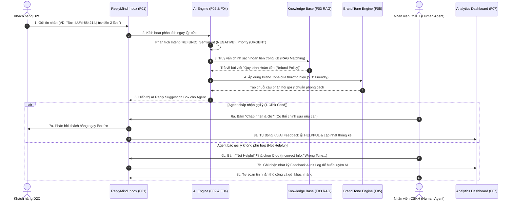

# Tóm Tắt Luồng Hoạt Động & Tổng Quan Base Code Dự Án ReplyMind

Tài liệu này tổng hợp toàn bộ **luồng hoạt động của hệ thống (System Workflow)** và **cấu trúc mã nguồn tổng quan (Base Code Architecture)** của dự án **ReplyMind** – Hệ thống SaaS hỗ trợ phản hồi khách hàng bằng AI cho các thương hiệu D2C.

---

## 1. Tổng quan Dự án (Project Overview)

- **Tên dự án:** ReplyMind – Hệ thống hỗ trợ phản hồi khách hàng cho thương hiệu D2C (Direct-to-Consumer).
- **Mô hình định hướng:** Web-First & Multi-Tenant SaaS.
- **Cơ chế hoạt động cốt lõi:** **AI Co-pilot (Human-in-the-Loop)** – Không tự động 100% gây rủi ro trả lời sai thông tin thương hiệu, mà đóng vai trò trợ lý AI thông minh nâng cao năng suất cho nhân viên CSKH (Agent) 3x - 5x, đảm bảo an toàn tuyệt đối cho bản sắc thương hiệu D2C.

---

## 2. Luồng Hoạt Động Của Dự Án (System Workflow)



### Các bước chi tiết trong luồng xử lý tin nhắn:
1. **Tiếp nhận & Phân tích tin nhắn (F01 & F02):**
   - AI phân loại **Intent**: `ORDER_STATUS`, `SHIPPING`, `DELIVERY_ISSUE`, `RETURN`, `REFUND`, `PRODUCT_QUESTION`, `COMPLAINT`.
   - AI đánh giá **Sentiment**: `POSITIVE`, `NEUTRAL`, `NEGATIVE`.
   - AI xác định **Priority**: `LOW`, `MEDIUM`, `HIGH`, `URGENT` (tin nhắn khẩn cấp/tiêu cực được đẩy nổi bật lên đầu Inbox với badge phát sáng).
2. **Truy vấn Knowledge Base & Tùy biến Brand Tone (F03, F04, F05):**
   - Hệ thống dùng thuật toán RAG ghép nối câu hỏi khách hàng với các bài viết chính sách trong Knowledge Base (F03).
   - Tự động biến đổi văn phong theo cấu hình Brand Tone của thương hiệu (`friendly`, `professional`, `casual`, `formal`) (F05).
3. **Kiểm duyệt & Gửi phản hồi (F04 & F06 - Human-in-the-Loop):**
   - Agent kiểm tra câu gợi ý, chỉnh sửa linh hoạt và bấm **1-Click Send**.
   - Nếu gợi ý chưa chuẩn, Agent phản hồi 👎 **Not Helpful** kèm lý do (F06) để phục vụ kiểm soát chất lượng AI.
4. **Tổng hợp Báo cáo Dashboard (F07):**
   - Hệ thống tự động tính toán tỷ lệ xử lý, Intent phổ biến, cảm xúc khách hàng, tỷ lệ chấp nhận gợi ý AI và điểm chất lượng AI Helpful Score.

---

## 3. Tổng Quan Cấu Trúc Base Code (Base Code Architecture)

```
d:\Code\ReplyMind\
├── docs/                                  # Tài liệu phân tích yêu cầu & luồng dự án
│   ├── AI in Requirement Analysis & Product Management/
│   │   ├── 3.1 Product Discovery/
│   │   ├── 3.2 Product Requirement Document (PRD)/
│   │   ├── 3.3 Requirement Analysis/
│   │   ├── 3.4 User Stories & Acceptance Criteria/
│   │   └── 3.5 Feature Specification/
│   └── ReplyMind_Workflow_and_BaseCode_Overview.md  # [TÀI LIỆU NÀY] Overview Luồng & Code
│
├── references/                            # Tài liệu kiến trúc & tham chiếu kỹ thuật
│   ├── SaaS_Architecture_Reference.md     # Sơ đồ kiến trúc SaaS, RBAC, Multi-tenancy
│   ├── D2C_CS_Platform_Benchmarks.md      # Đối sánh với Gorgias, Intercom Fin, Front
│   └── AI_Engine_KnowledgeBase_Specs.md   # Quy cách kỹ thuật AI Intent/Sentiment/RAG/Tone
│
├── src/                                   # Mã nguồn chính dự án (React + TS + Vite)
│   ├── types/
│   │   └── index.ts                       # Định nghĩa TypeScript data models (F01-F07)
│   ├── data/
│   │   └── mockData.ts                    # Dữ liệu mẫu thực tế cho thương hiệu D2C Lumina
│   ├── services/
│   │   ├── aiEngine.ts                    # AI Engine phân tích Intent, Sentiment & RAG Suggestion
│   │   └── storage.ts                     # Storage Service quản lý lưu trữ dữ liệu local
│   ├── components/
│   │   ├── layout/                        # Navbar (Brand Switcher), Sidebar (Navigation)
│   │   ├── inbox/                         # ConversationList, ChatWindow (AI Co-pilot), ContextPanel
│   │   ├── knowledgeBase/                 # KnowledgeBaseManager (F03 CRUD chính sách)
│   │   ├── brandTone/                     # BrandToneSettings (F05 Cấu hình giọng văn & Live Preview)
│   │   └── dashboard/                     # AnalyticsDashboard (F07 Báo cáo thống kê)
│   ├── styles/
│   │   └── index.css                      # Modern CSS design tokens, glassmorphism, scrollbars
│   ├── App.tsx                            # Root application component kết nối các phân hệ
│   └── main.tsx                           # Entry point React DOM
│
├── index.html                             # Web entry page với font Plus Jakarta Sans
├── package.json                           # Dependencies (React 18, Vite, Lucide-react)
├── tsconfig.json                          # Cấu hình TypeScript compiler
└── vite.config.ts                         # Cấu hình Vite bundler server
```

---

## 4. Bảng Ánh Xạ Tính Năng PRD Với Code (PRD Feature Mapping)

| Mã PRD | Tên tính năng | File mã nguồn chịu trách nhiệm chính | Mô tả chức năng trong base code |
| :--- | :--- | :--- | :--- |
| **F01** | Quản lý hội thoại | `src/components/inbox/ConversationList.tsx`, `ChatWindow.tsx` | Xem danh sách hội thoại, bộ lọc tìm kiếm, trạng thái Chưa xử lý / Đã xong. |
| **F02** | Phân tích tin nhắn bằng AI | `src/services/aiEngine.ts`, `src/components/inbox/CustomerContextPanel.tsx` | Phân tích tự động Intent (7 loại), Sentiment (3 mức), Priority (Urgent/High/Medium/Low). |
| **F03** | Knowledge Base | `src/components/knowledgeBase/KnowledgeBaseManager.tsx`, `src/services/storage.ts` | Quản lý kho bài viết chính sách D2C (Vận chuyển, Đổi trả, Hoàn tiền, FAQ) cho AI truy vấn. |
| **F04** | AI Reply Suggestion | `src/components/inbox/ChatWindow.tsx`, `src/services/aiEngine.ts` | Khung AI Co-pilot tự động soạn câu trả lời chuẩn tone & nguồn KB, cho phép 1-Click Send. |
| **F05** | Brand Tone | `src/components/brandTone/BrandToneSettings.tsx` | Cấu hình tone mặc định (Friendly, Professional, Casual, Formal) có Live Preview minh họa. |
| **F06** | AI Feedback | `src/components/inbox/ChatWindow.tsx`, `src/components/dashboard/AnalyticsDashboard.tsx` | Thu thập đánh giá 👍 Helpful / 👎 Not Helpful (kèm chọn lý do) để kiểm soát chất lượng AI. |
| **F07** | Dashboard | `src/components/dashboard/AnalyticsDashboard.tsx`, `src/services/storage.ts` | Báo cáo trực quan các chỉ số tổng quan, biểu đồ Intent, Sentiment, AI Adoption & Helpful Score. |

---

## 5. Hướng Dẫn Phát Triển & Khởi Chạy (Developer Quickstart)

```bash
# 1. Cài đặt các gói thư viện
npm install

# 2. Khởi chạy server phát triển local (Vite Dev Server)
npm run dev

# 3. Kiểm tra tính toàn vẹn của TypeScript Types
npx tsc --noEmit

# 4. Đóng gói ứng dụng cho môi trường Production
npm run build
```
