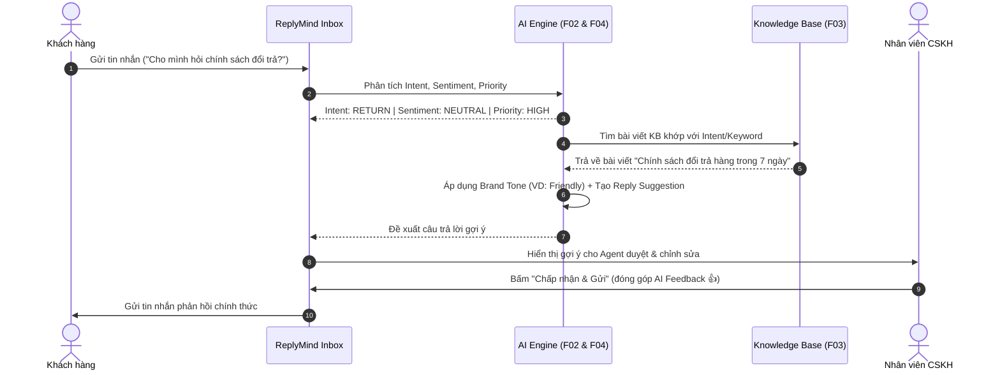

# AI Engine & Knowledge Base Specifications – ReplyMind

Tài liệu chi tiết quy cách kỹ thuật cho hệ thống **AI Engine** và **Knowledge Base (F02, F03, F04, F05, F06)** thuộc nền tảng ReplyMind.

---

## 1. Phân tích Tin nhắn bằng AI (Message AI Analysis Engine - F02)

### 1.1 Intent Classification (Phân loại ý định)
Hệ thống hỗ trợ phân loại 7 nhóm Intent cốt lõi cho thương hiệu D2C:

| Intent Key | Tên Intent | Ví dụ tin nhắn đầu vào | Mô tả hành vi mong muốn |
| :--- | :--- | :--- | :--- |
| `ORDER_STATUS` | Hỏi tình trạng đơn hàng | *"Đơn hàng #1042 của mình đang ở đâu rồi?"* | Tra cứu mã đơn, báo thời gian dự kiến giao |
| `SHIPPING` | Hỏi về vận chuyển | *"Shop có giao hỏa tốc trong ngày không?"* | Tra cứu chính sách vận chuyển & chi phí |
| `DELIVERY_ISSUE` | Vấn đề giao hàng | *"Shipper báo đã giao nhưng mình chưa nhận được."* | Kiểm tra đơn, báo bộ phận kho/shipper xử lý |
| `RETURN` | Yêu cầu đổi/trả | *"Áo bị rộng size, mình muốn đổi sang size M."* | Hướng dẫn quy trình đổi trả hàng trong KB |
| `REFUND` | Yêu cầu hoàn tiền | *"Sản phẩm bị vỡ khi nhận, yêu cầu hoàn tiền."* | Kiểm tra điều kiện hoàn tiền, hướng dẫn tiếp nhận |
| `PRODUCT_QUESTION` | Hỏi về sản phẩm | *"Kem chống nắng này da nhạy cảm dùng được không?"* | Tra cứu thông số & thành phần sản phẩm trong KB |
| `COMPLAINT` | Khiếu nại dịch vụ/SP | *"Chất lượng vải quá kém, làm ăn không uy tín!"* | Phản hồi xoa dịu, ưu tiên mức độ xử lý cao nhất |

### 1.2 Sentiment Analysis (Phân tích cảm xúc)
* **Positive (Tích cực):** Khen ngợi, cảm ơn, hài lòng.
* **Neutral (Trung lập):** Cung cấp thông tin, hỏi đáp thông thường.
* **Negative (Tiêu cực):** Thể hiện sự bất mãn, khó chịu, hối thúc.

### 1.3 Priority Detection (Mức độ ưu tiên)
* **Low (Thấp):** Hỏi đáp thông tin sản phẩm chung.
* **Medium (Trung bình):** Hỏi trạng thái đơn hàng bình thường.
* **High (Cao):** Đơn giao trễ, yêu cầu đổi size.
* **Urgent (Khẩn cấp):** Khiếu nại đúp tiền, giao sai/hỏng hàng, khách đang rất tức giận.

---

## 2. Cấu hình Brand Tone (Tone giọng thương hiệu - F05)

Mỗi thương hiệu D2C thiết lập **Brand Tone** để AI tùy biến phong cách viết câu phản hồi:

1. **Friendly (Thân thiện):** Sử dụng xưng hô gần gũi, emoticon nhẹ nhàng, văn phong ấm áp.
2. **Professional (Chuyên nghiệp):** Lịch sự, rõ ràng, tập trung vào giải quyết vấn đề, từ ngữ chuẩn mực.
3. **Casual (Gần gũi, Tự nhiên):** Trẻ trung, linh hoạt, phù hợp với các thương hiệu thời trang, Gen-Z D2C.
4. **Formal (Trang trọng):** Nghiêm túc, tôn trọng tối đa, dùng cho sản phẩm cao cấp / xa xỉ.

---

## 3. Knowledge Base & AI Suggestion Pipeline (F03 & F04)

---

## 4. Cơ chế Đánh giá AI Feedback (F06)

* Mỗi lượt dùng gợi ý AI cho phép Agent bấm:
  - 👍 **Helpful:** Chấp nhận và gửi (có thể có chỉnh sửa nhỏ).
  - 👎 **Not Helpful:** Bỏ qua gợi ý và chọn nguyên nhân:
    - *Incorrect Information* (Thông tin sai lệch với thực tế/chính sách)
    - *Wrong Tone* (Không khớp với Brand Tone đã chọn)
    - *Not Relevant* (Không hiểu đúng câu hỏi của khách hàng)
* Dữ liệu feedback này được tổng hợp đưa vào Dashboard (F07) để quản lý đánh giá hiệu quả của hệ thống AI.
