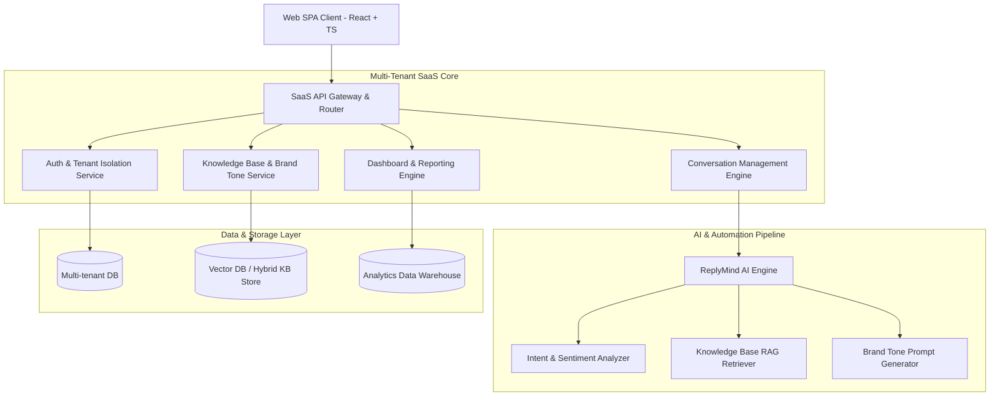

# SaaS Architecture Reference – ReplyMind Platform

## 1. Tổng quan Kiến trúc Web-First & SaaS (Web-First SaaS Architecture)

ReplyMind được thiết kế theo mô hình **Multi-Tenant SaaS (Phần mềm dịch vụ đa người dùng)** với định hướng **Web-First**, tối ưu trải nghiệm trên các trình duyệt hiện đại cho đội ngũ chăm sóc khách hàng (CSKH) của các thương hiệu D2C (Direct-to-Consumer).

---

## 2. Các nguyên tắc thiết kế SaaS cho D2C CSKH

### 2.1 Multi-Tenancy & Tenant Isolation (Tách biệt dữ liệu thương hiệu)
* **Phân tách theo Tenant ID (Organization / Brand ID):** Mọi request từ API Gateway đến Database/Vector DB đều gắn liền với `tenant_id`.
* **Cấu hình độc lập (Tenant Config):** Mỗi thương hiệu D2C có **Brand Tone** riêng (Friendly, Professional, Casual, Formal), Knowledge Base riêng và danh sách nhân viên phân quyền theo vai trò (Admin, Manager, Agent).

### 2.2 Quy trình Human-in-the-Loop (HITL AI Assist)
Không giống chatbot tự động 100% gây rủi ro trả lời sai thông tin chính sách/đơn hàng, ReplyMind vận hành theo cơ chế **AI Co-pilot / Assistant**:
1. **Khách hàng gửi tin nhắn** $\rightarrow$ Hệ thống tự động phân tích **Intent**, **Sentiment**, **Priority**.
2. **AI Engine truy vấn Knowledge Base** $\rightarrow$ Tạo **Reply Suggestion** theo đúng Brand Tone của thương hiệu.
3. **Agent xem gợi ý** $\rightarrow$ Chỉnh sửa (nếu cần) và bấm **Gửi** chỉ với 1 click.
4. **AI Feedback Loop** $\rightarrow$ Thu thập phản hồi (👍 Helpful / 👎 Not Helpful) để theo dõi chất lượng.

---

## 3. Kiến trúc Frontend Web-First (Client Architecture)

* **Framework:** React 18 / Vite + TypeScript.
* **UI/UX Strategy:**
  - **Split-Pane Inbox Layout:** Cột trái (Danh sách hội thoại + Filter theo Priority/Sentiment/Intent), Cột giữa (Nội dung chat + Khung gợi ý AI), Cột phải (Thông tin chi tiết hội thoại & Knowledge Base gợi ý).
  - **Real-time UX:** Cập nhật tin nhắn và gợi ý AI tức thì.
  - **Modern Design Tokens:** Phối màu hài hòa, hỗ trợ chế độ xem phẳng & tinh tế (Glassmorphism & Sleek Dark Mode option), hiệu ứng micro-animations mượt mà cho trải nghiệm làm việc liên tục của CSKH.

---

## 4. Bảng Phân Quyền Vai Trò (Role-Based Access Control - RBAC)

| Chức năng | Admin (Quản trị thương hiệu) | Manager (Quản lý đội ngũ CS) | Agent (Nhân viên CSKH) |
| :--- | :---: | :---: | :---: |
| **Quản lý hội thoại & Trả lời tin nhắn** | ✅ | ✅ | ✅ |
| **Sử dụng & Đánh giá AI Suggestion** | ✅ | ✅ | ✅ |
| **Xem Dashboard & Thống kê** | ✅ | ✅ | ❌ |
| **Quản lý Knowledge Base (F03)** | ✅ | ✅ | ❌ |
| **Cấu hình Brand Tone (F05)** | ✅ | ❌ | ❌ |
| **Quản lý Tài khoản & Phân quyền** | ✅ | ❌ | ❌ |

---

## 5. Tham chiếu bảo mật & khả năng mở rộng (Security & Scalability)

1. **Bảo mật dữ liệu (Data Security):**
   - Mã hóa mật khẩu và token truy cập (JWT / Secure Session).
   - Kiểm soát truy cập nghiêm ngặt ngăn chặn rò rỉ dữ liệu giữa các thương hiệu (Cross-tenant data leakage prevention).
2. **Khả năng mở rộng (Scalability):**
   - Sẵn sàng mở rộng tích hợp các kênh bán hàng D2C (Shopify, Shopee, Lazada, Facebook Messenger) trong các giai đoạn sau MVP.
